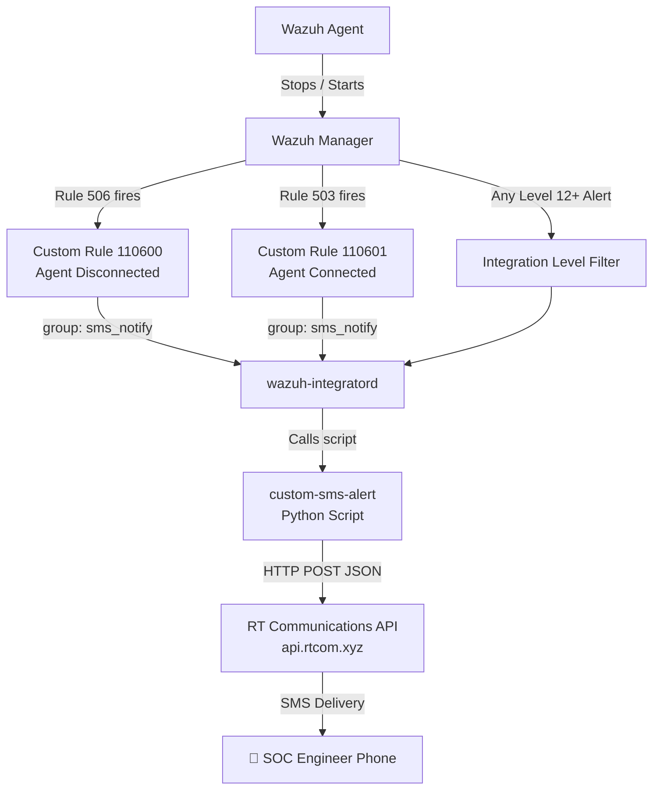

# 📱 Wazuh SMS Alerting via RT Communications API

Real-time SMS notifications from Wazuh SIEM for critical security events — agent connectivity changes and high-severity vulnerability alerts — using Bangladesh's RT Communications SMS gateway.

---

## 🎯 What This Integration Does

| Trigger | SMS Sent? | Why |
|--------|-----------|-----|
| Agent goes **OFFLINE** | ✅ Yes | Server/agent connectivity lost |
| Agent comes **ONLINE** | ✅ Yes | Agent reconnected to manager |
| Alert Level **≥ 12** (Critical) | ✅ Yes | High severity vulnerability detected |
| Alert Level < 12 | ❌ No | Avoid unnecessary SMS charges |

> **Cost-conscious design:** Only 2 event types trigger SMS to minimize charges on the paid RT Communications API.

---

## 🏗️ Architecture



---

## 📁 Repository Structure

```
wazuh-sms-alerting/
├── README.md
├── scripts/
│   └── custom-sms-alert          # Python integration script (no .py extension)
├── config/
│   ├── ossec_integration.xml     # Paste into ossec.conf
│   └── local_rules_sms.xml       # Paste into local_rules.xml
```

---

## ⚙️ Prerequisites

| Requirement | Detail |
|------------|--------|
| Wazuh Manager | v4.x (tested on 4.14.5) |
| Python 3 | Pre-installed on Wazuh manager |
| `requests` library | `pip install requests` |
| RT Communications Account | Active account at rtcom.xyz with balance |
| API Credentials | `acode`, `api_key`, `senderid` from portal |

---

## 🚀 Installation Guide

### Step 1 — Create the Integration Script

```bash
sudo nano /var/ossec/integrations/custom-sms-alert
```

Paste the full script content from `scripts/custom-sms-alert` and fill in your credentials:

```python
"acode":    "YOUR_ACODE",
"api_key":  "YOUR_API_KEY",
"senderid": "YOUR_SENDER_ID",
"contacts": "8801XXXXXXXXX",
```

### Step 2 — Set Correct Permissions

```bash
sudo chown root:wazuh /var/ossec/integrations/custom-sms-alert
sudo chmod 750 /var/ossec/integrations/custom-sms-alert
```

> ⚠️ **Critical:** The file must NOT have a `.py` extension. Wazuh's `integratord` looks for the file by the exact `<name>` value in `ossec.conf`. A `.py` extension causes `File not found` error and integration silently fails.

### Step 3 — Add Custom Rules

```bash
sudo nano /var/ossec/etc/rules/local_rules.xml
```

Add inside the `<group>` block:

```xml
<!-- Agent Stop/Start SMS Rules -->
<rule id="110600" level="5">
  <if_sid>506</if_sid>
  <description>Agent disconnected - SMS alert</description>
  <group>sms_notify,</group>
</rule>

<rule id="110601" level="5">
  <if_sid>503</if_sid>
  <description>Agent connected - SMS alert</description>
  <group>sms_notify,</group>
</rule>
```

> **Why custom rules?** Built-in rules 503/506 are level 3. Wazuh has a known restriction where agent-sourced events cannot trigger integrations via `<rule_id>` filter. The fix is to use a custom rule with a `<group>` tag, then filter by that group in `ossec.conf`.

### Step 4 — Add Integration Blocks to ossec.conf

```bash
sudo nano /var/ossec/etc/ossec.conf
```

Add before `</ossec_config>`:

```xml
<!-- SMS Alert: High Vulnerability (Level 12+) -->
<integration>
  <name>custom-sms-alert</name>
  <hook_url>https://api.rtcom.xyz/onetomany</hook_url>
  <level>12</level>
  <alert_format>json</alert_format>
</integration>

<!-- SMS Alert: Agent ON/OFF via group filter -->
<integration>
  <name>custom-sms-alert</name>
  <hook_url>https://api.rtcom.xyz/onetomany</hook_url>
  <group>sms_notify</group>
  <alert_format>json</alert_format>
</integration>
```

> **Why two blocks?** Wazuh does not support combining `<level>` and `<rule_id>` filters with OR logic in a single block. Two separate blocks are required.

### Step 5 — Restart Wazuh Manager

```bash
sudo systemctl restart wazuh-manager
```

Verify integration loaded:

```bash
sudo grep -i "custom-sms" /var/ossec/logs/ossec.log | tail -5
```

Expected output:
```
wazuh-integratord: INFO: Enabling integration for: 'custom-sms-alert'.
wazuh-integratord: INFO: Enabling integration for: 'custom-sms-alert'.
```

---

## 🧪 Testing

### Manual Script Test (without agent stop/start)

```bash
# Create fake alert JSON
cat > /tmp/test_alert.json << 'EOF'
{"rule":{"id":"110600","level":5,"description":"Agent disconnected"},"agent":{"name":"rakib-virtual-machine"}}
EOF

# Run script directly
sudo python3 /var/ossec/integrations/custom-sms-alert /tmp/test_alert.json "" ""

# Check result
sudo cat /var/ossec/logs/sms_debug.log
```

Expected log entry:
```
[2026-06-20 05:18:12] RuleID:110600 Level:5 Agent:rakib-virtual-machine Status:200 Response:{"response":{"code":200,"message":"Success"},...}
```

### Live Agent Test

```bash
# On agent machine — stop agent
sudo systemctl stop wazuh-agent

# Watch SMS debug log on manager
sudo tail -f /var/ossec/logs/sms_debug.log

# Start agent again
sudo systemctl start wazuh-agent
```

---

## 🐛 Troubleshooting

| Problem | Cause | Fix |
|--------|-------|-----|
| `File not found inside 'integrations'` | Script named `custom-sms-alert.py` | Rename to `custom-sms-alert` (no extension) |
| `integrations.log` empty after agent stop | Using `<rule_id>` filter | Switch to `<group>sms_notify</group>` filter |
| Script runs manually but not automatically | Wrong file permissions | `chown root:wazuh` + `chmod 750` |
| `Permission denied` on log file | Reading as non-root | Use `sudo cat` for log files |
| SMS not sent but Status 200 | API balance zero | Check balance at rtcom.xyz portal |

### Debug Commands

```bash
# Check integration daemon status
sudo grep -i "integrat" /var/ossec/logs/ossec.log | tail -20

# Check if rules fire on agent stop
sudo grep "110600\|110601" /var/ossec/logs/alerts/alerts.log | tail -10

# Check SMS API response
sudo cat /var/ossec/logs/sms_debug.log

# Check script errors
sudo cat /var/ossec/logs/sms_error.log
```

---

## 📲 Sample SMS Messages

**Agent Offline:**
```
[WAZUH ALERT]
Agent OFFLINE!
Agent: rakib-virtual-machine
Time: 05:31 20-06-2026
```

**Agent Online:**
```
[WAZUH ALERT]
Agent ONLINE
Agent: rakib-virtual-machine
Time: 05:32 20-06-2026
```

**High Severity Alert:**
```
[WAZUH HIGH ALERT]
Level: 12
Agent: rakib-virtual-machine
Rule: 87103
Desc: Suricata: Alert - ET SCAN...
```

---

## 🔑 Key Technical Discoveries

1. **No `.py` extension** — Wazuh `integratord` matches `<name>` exactly to filename in `/var/ossec/integrations/`. Extension causes silent failure.

2. **`<group>` filter over `<rule_id>` filter** — Wazuh has a security restriction preventing agent connectivity events (rules 503/506) from triggering integrations via `<rule_id>`. Using a custom rule with a named group and filtering by `<group>` bypasses this.

3. **Two integration blocks needed** — Level-based and group-based filters cannot be combined with OR logic in one block.

---

## 👤 Author

**Rakibul Islam Joy**
Security Engineer | SOC Home Lab
- GitHub: [github.com/rakibuljoy](https://github.com/rakibuljoy)
- LinkedIn: [linkedin.com/in/rakibul-islam-joy-4166a3242](https://linkedin.com/in/rakibul-islam-joy-4166a3242)

Part of an ongoing Wazuh SOC Home Lab series including VirusTotal integration, YARA malware detection, Suricata IDS, Fail2ban, and brute-force auto-blocking.
